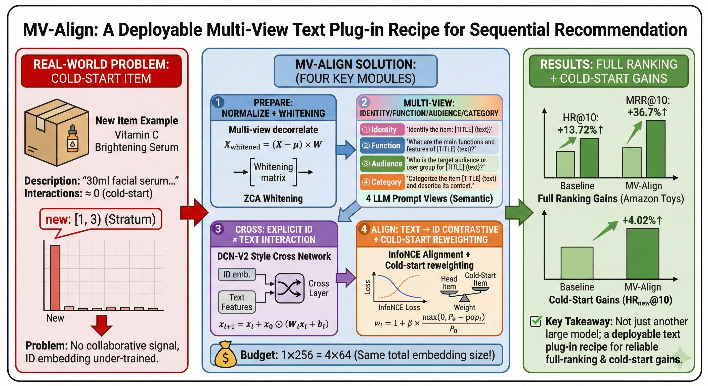

# MV-Align: Multi-View Text Alignment with Explicit Feature Crossing for Sequential Recommendation

<p align="center">
  
</p>

**MV-Align** introduces a *prepare--interact--align* recipe on top of SASRec:
**(1)** per-view whitening decorrelates multi-view LLM embeddings;
**(2)** an explicit cross network (DCN-V2) captures high-order ID x Text interactions;
**(3)** multi-view contrastive alignment with cold-start reweighting bridges text and collaborative spaces.

---

## Main Results

Full-ranking evaluation at K={5, 10, 20} on Amazon Beauty and Toys\&Games. Mean +/- std over 4 seeds {42, 2024, 2025, 2026}. All values in %.

### Amazon Beauty

| Model | HR@10 | NDCG@10 | MRR@10 | HR_new@10 | NDCG_new@10 | MRR_new@10 | HR_few@10 | NDCG_few@10 | MRR_few@10 | HR_freq@10 | NDCG_freq@10 | MRR_freq@10 |
|:------|------:|--------:|-------:|----------:|------------:|-----------:|----------:|------------:|-----------:|-----------:|-------------:|------------:|
| SASRec (ID-only) | 5.42+/-0.18 | 2.93+/-0.04 | 2.14+/-0.01 | 1.88+/-0.03 | 1.05+/-0.02 | 0.78+/-0.02 | 3.46+/-0.04 | 1.91+/-0.02 | 1.42+/-0.03 | 9.28+/-0.38 | 4.98+/-0.10 | 3.64+/-0.02 |
| + TF-IDF | 5.56+/-0.02 | 3.69+/-0.02 | 3.11+/-0.01 | 1.63+/-0.02 | 1.21+/-0.02 | 1.08+/-0.03 | 3.32+/-0.05 | 2.34+/-0.03 | 2.04+/-0.03 | 9.73+/-0.04 | 6.35+/-0.01 | 5.30+/-0.01 |
| + TF-IDF + LLM | 5.62+/-0.03 | 3.73+/-0.01 | 3.15+/-0.01 | 1.64+/-0.02 | 1.24+/-0.01 | 1.11+/-0.02 | 3.36+/-0.03 | 2.38+/-0.02 | 2.07+/-0.02 | 9.84+/-0.05 | 6.41+/-0.02 | 5.36+/-0.02 |
| **MV-Align (7B)** | **5.79+/-0.03** | **3.80+/-0.02** | **3.19+/-0.02** | **1.76+/-0.04** | **1.28+/-0.02** | **1.12+/-0.03** | **3.54+/-0.02** | **2.50+/-0.03** | **2.17+/-0.03** | **10.07+/-0.07** | **6.50+/-0.04** | **5.40+/-0.03** |

### Amazon Toys\&Games

| Model | HR@10 | NDCG@10 | MRR@10 | HR_new@10 | NDCG_new@10 | MRR_new@10 | HR_few@10 | NDCG_few@10 | MRR_few@10 | HR_freq@10 | NDCG_freq@10 | MRR_freq@10 |
|:------|------:|--------:|-------:|----------:|------------:|-----------:|----------:|------------:|-----------:|-----------:|-------------:|------------:|
| SASRec (ID-only) | 5.92+/-0.03 | 3.30+/-0.02 | 2.48+/-0.02 | 1.92+/-0.03 | 1.08+/-0.02 | 0.81+/-0.01 | 4.64+/-0.03 | 2.53+/-0.01 | 1.88+/-0.00 | 10.48+/-0.05 | 5.88+/-0.03 | 4.43+/-0.03 |
| + TF-IDF | 6.29+/-0.03 | 4.26+/-0.01 | 3.64+/-0.00 | 1.83+/-0.03 | 1.38+/-0.02 | 1.23+/-0.02 | 4.64+/-0.04 | 3.22+/-0.03 | 2.77+/-0.03 | 11.38+/-0.06 | 7.62+/-0.02 | 6.46+/-0.02 |
| + TF-IDF + LLM | 6.39+/-0.02 | 4.32+/-0.01 | 3.67+/-0.01 | 1.89+/-0.04 | 1.41+/-0.02 | 1.26+/-0.02 | 4.73+/-0.03 | 3.28+/-0.02 | 2.83+/-0.01 | 11.53+/-0.04 | 7.70+/-0.02 | 6.52+/-0.02 |
| **MV-Align (7B)** | **6.61+/-0.03** | **4.39+/-0.02** | **3.71+/-0.02** | **2.04+/-0.03** | **1.47+/-0.01** | **1.29+/-0.01** | **4.97+/-0.07** | **3.38+/-0.02** | **2.89+/-0.01** | **11.85+/-0.07** | **7.79+/-0.06** | **6.54+/-0.05** |

> **Popularity strata**: *new* = [1, 3) interactions; *few* = [3, 10); *frequent* = [10, +inf).

### Key Takeaways

1. **TF-IDF is a strong baseline.** On Beauty, TF-IDF alone improves HR@10 by +2.6% and NDCG@10 by +25.9% over ID-only.
2. **Multi-view outperforms single-view under equal bandwidth** (4x64-d vs 1x256-d), with the largest gains on cold-start items.
3. **HR--ranking trade-off.** The cross network sharpens ranking quality (MRR/NDCG) at the cost of recall (HR); disabling it reverses this balance -- directly mapping to candidate-generation vs. re-ranking deployment choices.

---

## Requirements

- Python 3.8+
- PyTorch >= 1.7.0
- CUDA-enabled GPU (tested on A100 / V100)

```bash
pip install -r requirements.txt
```

For LLM embedding generation, additionally install:

```bash
pip install transformers accelerate
```

## Repository Structure

```
.
├── recbole/                  # RecBole framework (minimal subset)
│   ├── model/sequential_recommender/
│   │   ├── sasrecalignv3.py          # SASRecAlignV3 (TF-IDF / TF-IDF+LLM)
│   │   └── sasrecalignmultiviewv3.py # SASRecAlignMultiViewV3 (multi-view)
│   └── ...                           # config, data, evaluator, trainer, utils
├── scripts/
│   └── two_phase_train.py    # Two-phase training entry point
├── tools/                    # Embedding generation utilities
├── configs/                  # YAML configurations
│   ├── beauty/               #   Amazon Beauty configs
│   ├── toys/                 #   Amazon Toys & Games configs
│   └── ablation/             #   Ablation study configs
├── run_scripts/              # One-click reproduction scripts
│   ├── run_main_table.sh     #   Table 2: main results (8 configs x 4 seeds)
│   ├── run_baseline.sh       #   Table 2: ID-only baseline (4 seeds)
│   ├── run_ablation_all.sh   #   Table 3: component ablation
│   ├── run_sensitivity_all.sh#   Figure 4: hyperparameter sensitivity
│   ├── gen_text_emb_beauty.sh#   Feature generation: Beauty
│   └── gen_text_emb_toys.sh  #   Feature generation: Toys & Games
├── dataset/                  # Place datasets here (see below)
├── figures/                  # Framework figure and cover image
├── run_recbole.py            # Single-phase training entry point
├── setup.py
└── requirements.txt
```

## Datasets

Download the Amazon Review datasets (5-core) and place them under `dataset/`:

```
dataset/
├── Amazon_Beauty/
│   ├── Amazon_Beauty.inter          # user_id, item_id, rating, timestamp
│   └── Amazon_Beauty.item           # item_id, title, ...
└── Amazon_Toys_and_Games/
    ├── Amazon_Toys_and_Games.inter
    └── Amazon_Toys_and_Games.item
```

| Dataset | #Users | #Items | #Interactions | Density |
|:--------|-------:|-------:|--------------:|--------:|
| Beauty | 1,210,272 | 259,217 | 2,023,071 | 0.0006% |
| Toys & Games | 1,342,912 | 336,080 | 2,252,772 | 0.0005% |

<!-- TODO: Add download links or instructions -->

## Quick Start

### Step 0: Install

```bash
pip install -e .
```

### Step 1: Generate Text Embeddings

TF-IDF embeddings (CPU only):

```bash
bash run_scripts/gen_text_emb_beauty.sh
bash run_scripts/gen_text_emb_toys.sh
```

For LLM embeddings, set `LLM_MODEL_PATH` to Qwen2.5-7B-Instruct:

```bash
export LLM_MODEL_PATH=/path/to/Qwen2.5-7B-Instruct
bash run_scripts/gen_text_emb_beauty.sh
bash run_scripts/gen_text_emb_toys.sh
```

This generates per dataset:

| File | Description | Dim |
|:-----|:------------|----:|
| `item_text_emb.base.npy` | TF-IDF + SVD + ZCA whitening | 256 |
| `item_text_emb.qwen2.5_7b.base.npy` | Single-view LLM (mean pooling) | 256 |
| `qwen2.5_7b_4views/view_{0..3}.npy` | Multi-view LLM (identity / function / audience / category) | 4 x 64 |

### Step 2: Reproduce Results

```bash
# ID-only baseline (Table 2, SASRec rows)
bash run_scripts/run_baseline.sh [GPU_ID]

# Main table (Table 2, all text-enhanced models, 8 configs x 4 seeds)
bash run_scripts/run_main_table.sh [GPU_ID]

# Ablation study (Table 3, Toys 7B)
bash run_scripts/run_ablation_all.sh [GPU_ID]

# Hyperparameter sensitivity (Figure 4)
bash run_scripts/run_sensitivity_all.sh [GPU_ID]
```

All scripts accept an optional GPU ID argument (default: 0).

## Experiment Configurations

### Main Table (Table 2)

| Configuration | Model Class | Config |
|:--------------|:------------|:-------|
| SASRec (ID-only) | SASRecAlign | `configs/{beauty,toys}/sasrec_baseline_50ep_*_stratified.yaml` |
| + TF-IDF | SASRecAlignV3 | `configs/{beauty,toys}/sasrec_align_*_base_stratified_v3.yaml` |
| + TF-IDF + LLM | SASRecAlignV3 | `configs/{beauty,toys}/sasrec_align_*_qwen3_stratified_v3.yaml` |
| MV-Align (7B) | SASRecAlignMultiViewV3 | `configs/{beauty,toys}/sasrec_align_multi_view_v3_*_stratified*.yaml` |

### Two-Phase Training Protocol

| Phase | Epochs | Backbone | Text Head LR | Cross/DNN LR | Selection |
|:------|-------:|:---------|-------------:|-------------:|:----------|
| **A** (warmup) | 20 | Frozen | 2e-3 | 5e-4 | Grid on (lambda, tau) via MRR@10 |
| **B** (joint) | 40 | Unfrozen (LR x 0.1) | 2e-3 | 5e-4 | Early stopping |

### Key Hyperparameters

| Parameter | Symbol | Default | Description |
|:----------|:------:|:-------:|:------------|
| `align_weight` | lambda | 0.10 | Contrastive alignment loss weight |
| `temperature` | tau | 0.05 | InfoNCE temperature |
| `cold_text_boost` | beta | 3.0 | Training cold-start reweighting coefficient |
| `infer_boost` | beta_infer | 0.6 | Inference cold-start boosting coefficient |
| `cold_threshold` | P_0 | 10 | Cold-start popularity threshold |

### Evaluation Protocol

- **Full ranking** over the entire item set at K = {5, 10, 20}
- **Metrics**: HR, NDCG, MRR (Precision also computed)
- **Popularity-stratified** analysis: new [1, 3), few [3, 10), frequent [10, +inf)
- **4 random seeds**: {42, 2024, 2025, 2026}, reporting mean +/- std

## Citation

```bibtex
% Citation to be added after acceptance.
```

## License

This project is built on [RecBole](https://github.com/RUCAIBox/RecBole) and follows its MIT license.
